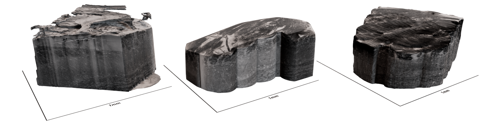
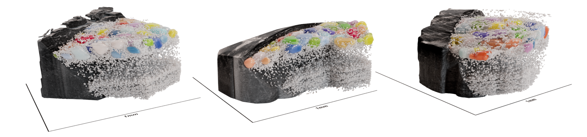
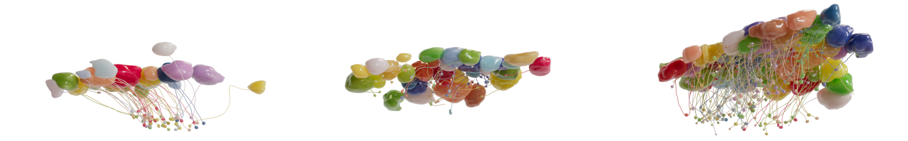
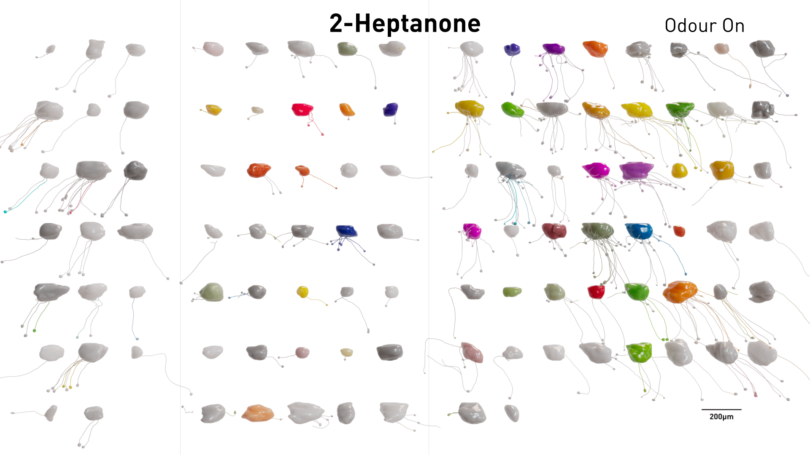

# sister_2p_xnh
:wave: Welcome to the sister_2p_xnh repo, where we release datasets and analysis scripts used for plots in: 

**Structure-Function Mapping of Olfactory Bulb Circuits with Synchrotron X-ray Nanotomography** ([preprint link](https://doi.org/10.1101/2025.04.24.650439 ))

https://github.com/user-attachments/assets/4ba7463c-ceb2-4fa6-b838-1361cc35e384

https://github.com/user-attachments/assets/16fb0582-1ffc-40af-886a-ff2e88c64309

Full video links: [sample Y489](https://youtu.be/godL2-4rQKU), [all 3 samples](https://youtu.be/ue9DysFshfQ).


## :mag_right: The story
In this study, we first used **in vivo 2-photon (2P)** to record odour responses of projection neurons in the mouse olfactory bulb; we then acquired sub- $mm^3$ **synchrotron X-ray nano-holotomography (XNH)** structural datasets of the same tissue.






We are particularly interested in studying how **sister cells** respond to odours. Sister cells are projection neurons that project their single apical dendrite to the same glomerulus. The function of these sister cells in mammalian olfaction has been a long standing question that is particularly hard to study due to challenges in identifying sister cells.

Using the correlative 2p-XNH datasets, we densely mapped the apical dendrites of functionally recorded neurons. This gave us three large sister cell datasets from three animals.



We found that:
- sister cells are similar in odour tuning, for strongly and weakly activating odours
- but they show consistent differences in temporal dynamics to some odours
- with a toy model, we explored the benefit of such '**balanced diversity**' in sister cells, in odour encoding capacity and generalization ability

This study opens up many future research questions: 
- how would sister cells respond to odours of different concentrations, mixtures or temporal structures?
- what are potential circuit mechanisms that result in the observed sister cell responses?

This study also showcases the power of the **structure-function approach** to study neuronal circuits, with a highlight in the **emerging structure imaging methods using synchrotron X-ray**.


## :woman_technologist: Getting started
1. clone this repo
2. download [curated 2p data from Zenodo](https://zenodo.org/records/15150149)
3. create a [conda environment](https://docs.conda.io/projects/conda/en/stable/user-guide/getting-started.html) with necessary packages
```
conda create -n my_env python=3.8.16 numpy=1.23.5 pandas=1.5.2 scipy=1.10.0 matplotlib seaborn jupyter
```
4. start jupyter in this conda environment
```
conda activate my_env
jupyter notebook
```
6. update path to repo and downloaded dataset in scripts:

> Edit `%run /path_to_sister_2p_xnh_repo/scripts/startup.py` in [analysis_01.ipynb](https://github.com/yz22015/sister_2p_xnh/blob/main/scripts/analysis_01.ipynb)

> Edit `workingDir = '/path_to_downloaded_datasets'` in [startup.py](https://github.com/yz22015/sister_2p_xnh/blob/main/scripts/startup.py)

5. run [analysis_01.ipynb](https://github.com/yz22015/sister_2p_xnh/blob/main/scripts/analysis_01.ipynb) to reproduce plots (for key figures for now, but we will release all plots after peer review)

Please contact us if you have any questions! 
## :monocle_face: The datasets

1. XNH datasets:

All relevant skeletal tracings and segmentations can be viewed and downloaded with the below wklinks. You could also download and annotate these dataset yourselves. See [webknossos documentation](https://docs.webknossos.org/webknossos/data/).

|sample|XNH skeletons|XNH segmentations|wklink|
|-|-|-|-|
|C432|glomerulus contours, apicals|glomeruli, nuclei|[wklink for tracing and segmentation](https://wklink.org/1058)|
|Y391|glomerulus contours, apicals|glomeruli, nuclei|[wklink for tracing and segmentation](https://wklink.org/5226)|
|Y489|glomerulus contours, apicals, laterals|glomeruli, nuclei|[wklink for tracing](https://wklink.org/2405), [wklink for segmentation](https://wklink.org/2634)|

2. 2P datasets:

The curated 2P data can be found in [this Zenodo release](https://zenodo.org/records/15150149). The raw 2P movies are available upon request. Each wklink below refers to an `in vivo high resolution 2P dataset`, which is a static snapshot of the functionally recorded volume, containing both GCaMP and blood vessel channels.

|sample|2P contains|wklink|
|-|-|-|
|C432|mitral cells|[wklink](https://wklink.org/2994)|
|Y391|glomeruli, tufted cells|[wklink](https://wklink.org/1735)|
|Y489|glomeruli, tufted cells, mitral cells|[wklink](https://wklink.org/2685)|

3. Intermediate datasets:

Additional datasets from this study can be accessed [here](https://github.com/FrancisCrickInstitute/warpAnnotations/tree/main/warping/data). They include _ex vivo_ anatomical dataset with 2P, lab sourced X-ray and propagation-based phase contrast synchrotron X-ray tomography datasets.


4. Dataset registration:

All datasets (e.g. 2P, XNH) of a sample are registered to each other through warping. Skeletal and segmentation annotations can be warped among datasets with [warpAnnotations](https://github.com/FrancisCrickInstitute/warpAnnotations/tree/main).


## :books: Related publications
If you are interested in the correlative 2P-XNH workflow or sister cells, you may want to check out our other related publications. This study is built on these previous studies.
1. [Bosch _et al._ 2022](https://doi.org/10.1038/s41467-022-30199-6) bench-top X-ray, synchrotron X-ray methods, correlative imaging workflows
2. [Zhang _et al._ 2022](https://doi.org/10.3389/fcell.2022.880696) heavy metal staining of mouse olfactory bulb, dataset registration accuracy
3. [Bosch _et al._ 2023](https://doi.org/10.1063/5.0142405) fs-laser milling to get optimal sample geometry for X-ray imaging
4. [Nathansen _et al._ 2024](https://doi.org/10.1117/12.3028309) nuclei segmentation in XNH datasets
5. [Laugros _et al._ 2025](https://doi.org/10.1101/2025.02.10.633538) novel acquisition and denoising pipeline to improve resolution of XNH datasets
6. [Tootoonian _et al._ 2022](https://doi.org/10.1371/journal.pcbi.1009808) sister cells for odour inference

Please also refer to citations in the paper for previous optical approaches to study sister cells and discussions in olfaction.

## :raised_hands: Acknowledgement
This study is done in close collaboration with X-ray physicists at various synchrotrons in the world. Please see the paper for full acknowledgement.


## :phone: Contacts
Get in touch with us for further questions: [Yuxin Zhang](mailto:yuxin.zhang@crick.ac.uk), [Carles Bosch](mailto:carles.bosch@crick.ac.uk), [Alexandra Pacureanu](mailto:joitapac@esrf.fr), [Andreas T Schaefer](mailto:andreas.schaefer@crick.ac.uk)


